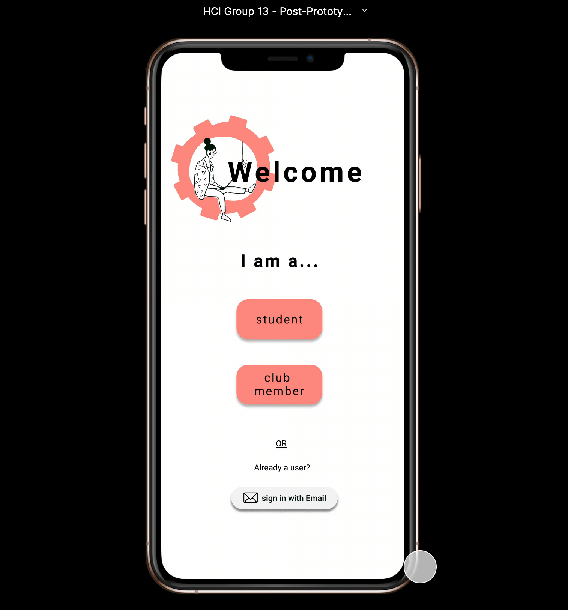
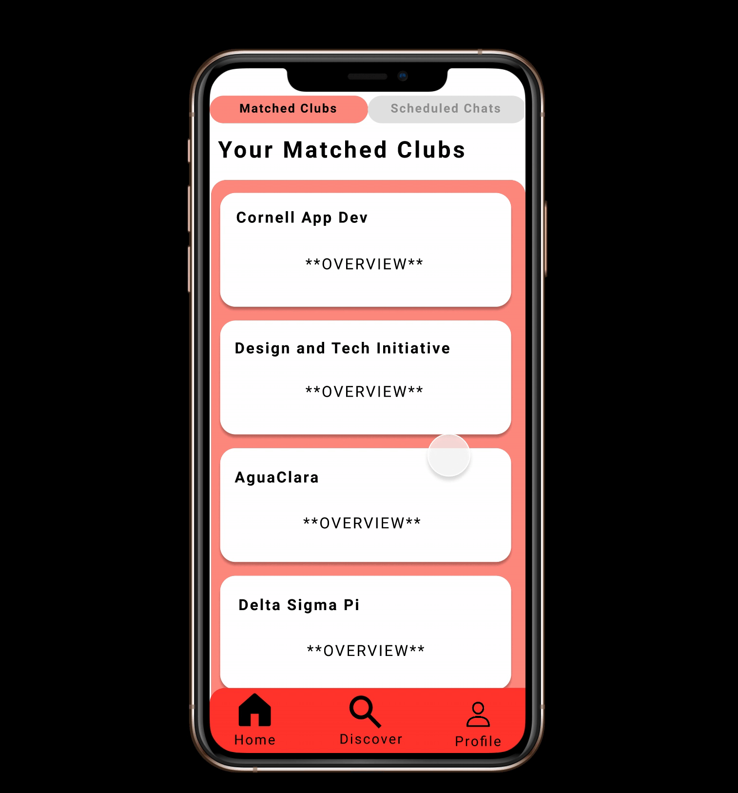
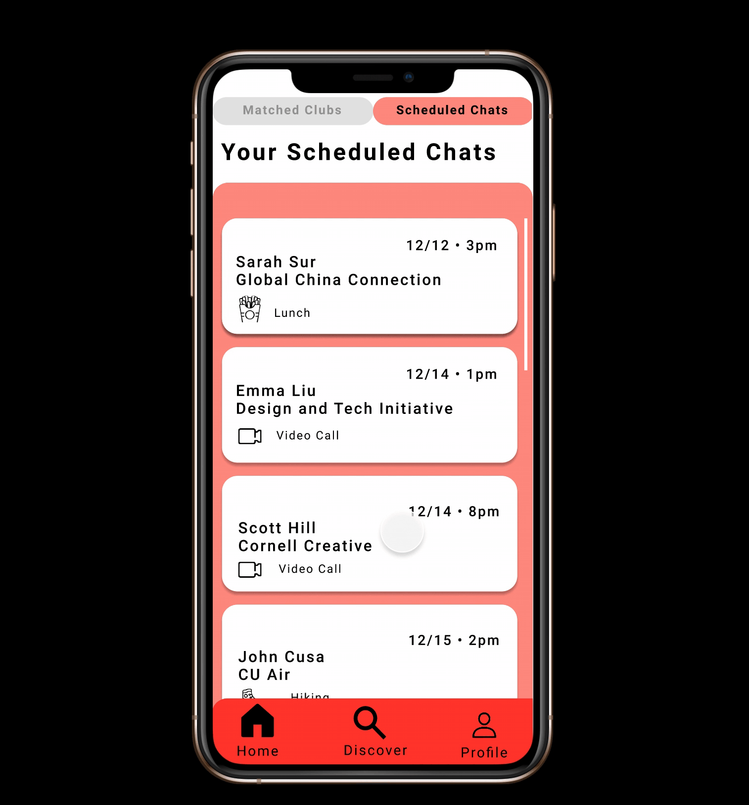
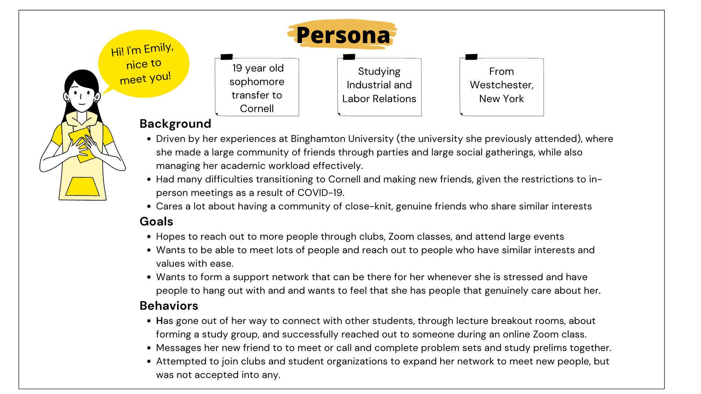
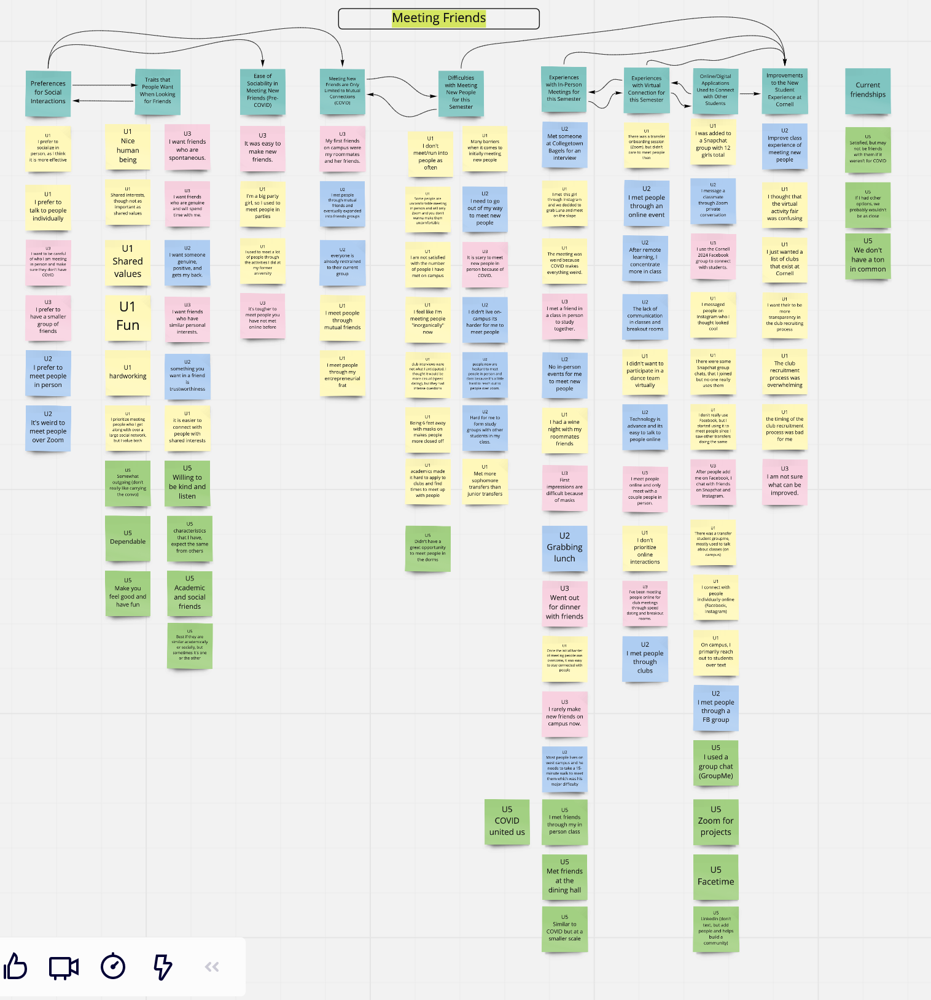
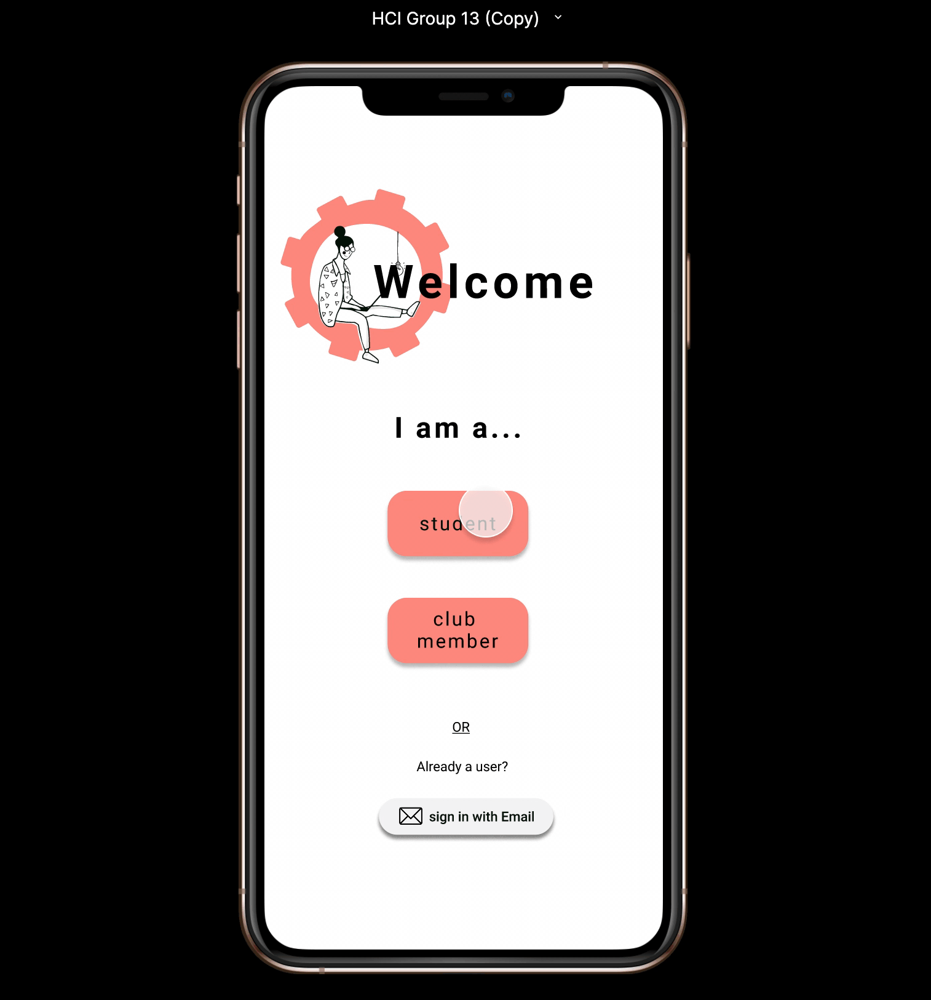
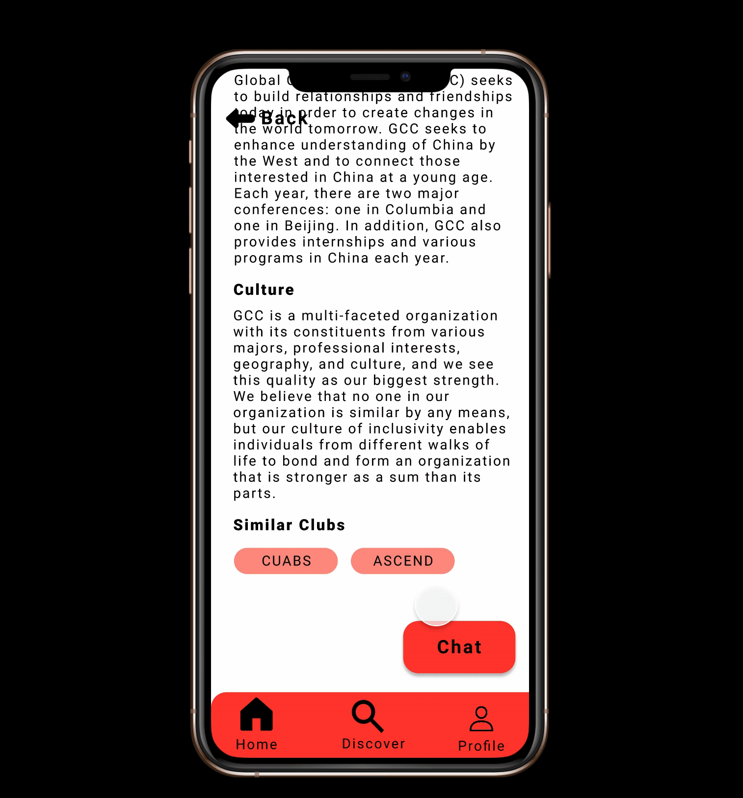
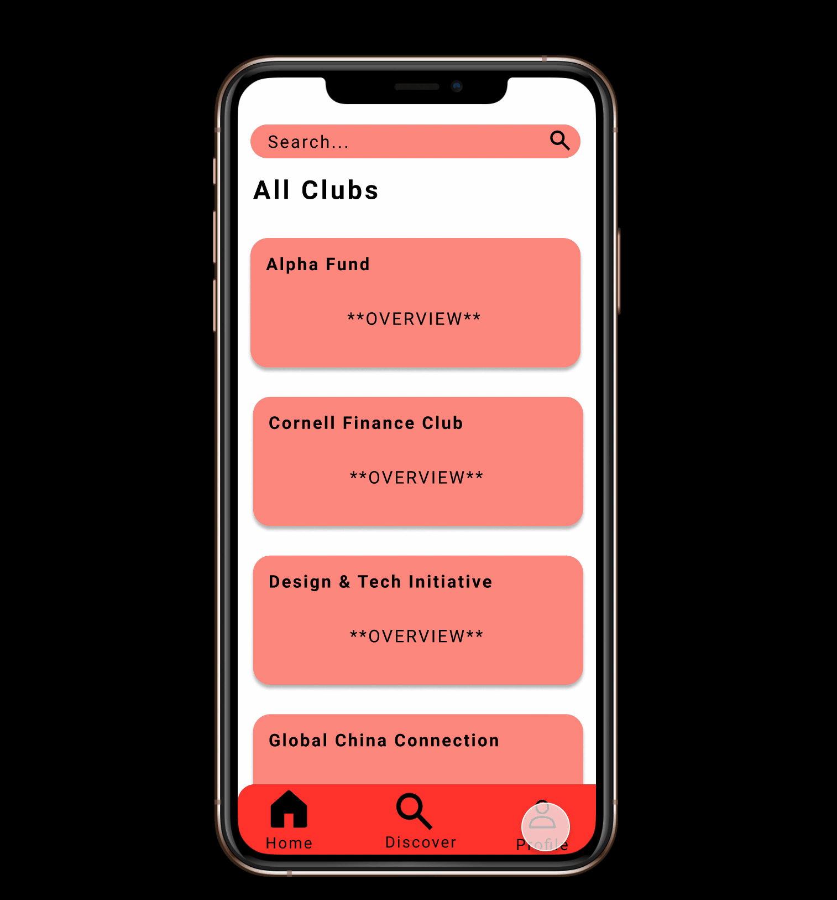
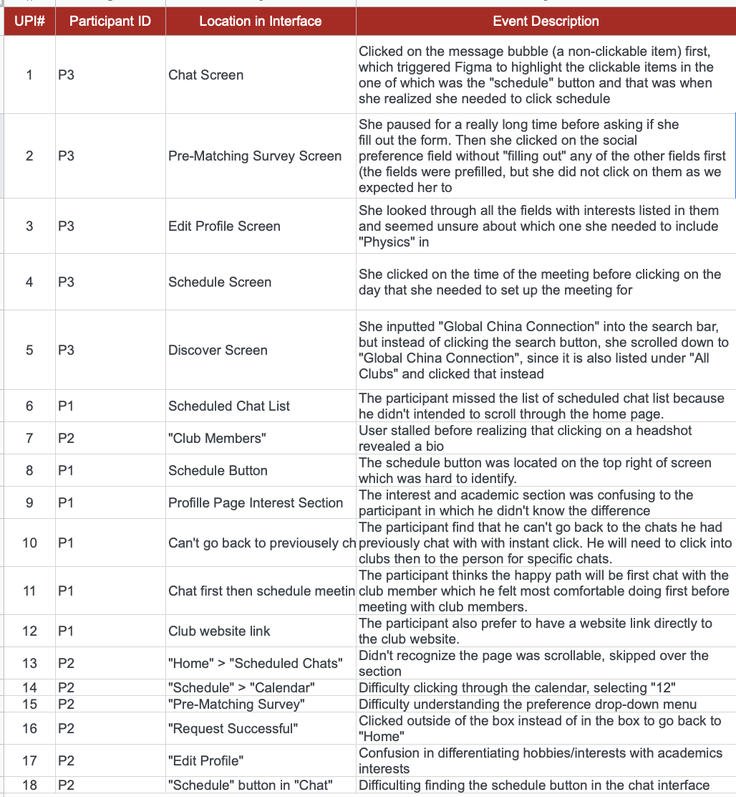
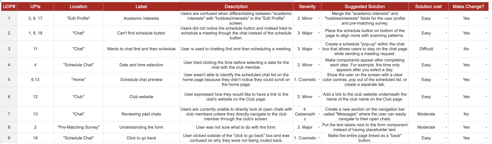

__Timeline__: Sep 2020 - Dec 2020

__Tools__: Figma, Miro

__Role__: Designer, Researcher

__Other Info__: Class Project for Human Computer Interaction Design

### Overview
We were fortunate that Cornell’s campus was open to students during the pandemic. However, most classes were online and in-person events were limited to small gatherings. In these conditions, it can be difficult for new undergraduate students to meet people and make friends even though they were all in close proximity to each other.

__Project Goal__:
Design a solution that makes it easier for new students to meet one another and help them build a community of close friends.

__Target user group__:
New undergraduate students at Cornell including freshmen and transfer students who are on campus.

__Overview of the final solution__:
An app that helps students navigate the competitive club recruitment process (more on club recruitment later). It matches users to clubs based on interests and desired club culture and a chat function that allows users to speak and complete a virtual or in-person activity with a club officer.

Fill out profile information:

Search for clubs:

Schedule meeting with an officer:

Modify profile information:

### User Research (Part I)
We conducted interviews with 3 new undergraduate students to understand their current experiences with making friends on campus and what they look for in a friend.
Using Miro for affinity diagramming we gathered 3 key insights:

* Interviewees were limited to meeting friends through mutual connections. Due to restrictions on in-person gatherings, interviewees had difficulty in creating study groups for classes and making friends organically in social settings. 
* Interviewees reported preferring friends who shared the same interest, values and have genuine personalities. Most noted that they still value people with shared values over shared interests, but it is easier to connect if there are shared interests.
* Interviewees reported to use Facebook to add an extensive network of friends whereas Snapchat and Instagram were used to chat directly with a select group of friends, sometimes leading to in-person meetings. 

We constructed a persona, Emily, based on our interviews:

### Current Solution Space
We explored the current solution space to see what problems have already been addressed and what was missing based on our user research.

__What existing solutions address__:
* Allowing users to be exposed to a diverse population of people across colleges
* Provide students with the opportunity to meet people remotely during the pandemic
* Being able to make new friends in the user’s academic year, major, and with those experiencing similar challenges.

__What’s missing__:
* No virtual to in-person meet-up conversion in one solution
* Harder to get to know someone on a deeper level
* More difficult to create a support network online compared to in-person

### Brainstorming
As we were brainstorming, we realized that our design ideas stemmed from surface-level insights and didn’t properly address a core issue within our identified user base. In order to gain additional insight, we conducted another round of user research with one of the previous interviewees and recruited a new one.

### User Research (Part 2)

__Final affinity diagram__:

_Note: the arrows represent hierarchical relationships between clusters_

After the additional interviews were completed and updating our affinity diagram, our group uncovered a new insight: __the difficulty that new students faced in joining competitive clubs.__

### Back to Brainstorming
With the new insight in mind, our group realized that interviewees have made unsuccessful efforts towards joining communities and making new friends through club recruitment because of the lack of understanding of the recruitment process, misinterpretation of club culture, and the lack of prior connections within the club. Although “coffee chat” opportunities exist for prospective applicants, some mentioned that coffee chats are intimidating and that conversations are often transactional and surface level.

The design idea we moved forward with was the one mentioned earlier in this article.

__Tasks__:
Pre-Matching Survey

_Users fill out a survey when they set up an account on the app so that the app can generate a list of clubs that match their interests._

Searching for Clubs

_Users use keywords to search for a specific club they are curious about, but were not matched with or clubs catered toward a specific interest._

Chatting with an Officer

_The user can chat with or set up a meeting with a club officer to learn more about the club culture, recruitment process, and connect with them on a more personal level._

### Prototyping
We sketched basic UI screens together and used that for the basis of our paper prototype, which we used to conduct user testing.

You can view the full paper prototype [here](https://youtu.be/X4E9WFbllt0)

The main changes we decided to make based off user feedback were:
* Make the menu bar present on all the screens
* The chat function should also be available for both in person and virtual meet ups
* Include a section that lists clubs similar to the club being selected

We also decided to add a 4th task: editing your profile. This allows the user to update their profile if their interests change so that they can get matched to clubs that match their current interests.

Keeping in mind the feedback from our user tests, we created a mid-to-high fidelity prototype of our app in Figma. 

Fill out profile information:

Search for clubs:

Schedule meeting with an officer:

Modify profile information:

### Usability Testing
One of the goals of this app is to make navigating the competitive club recruitment process easier, so it was important that we test the ease in which the user can use our app and user satisfaction. The usability metrics we focused on were effectiveness, learnability, error rate, and satisfaction.

We recruited 3 users in our target user group to conduct a usability test of our high-fidelity prototype. Based on the user testing session, we identified a list of UX problem instances (UPIs) from our usability testing session. From there, we identified the underlying UX design problems (UDPs) that caused one or more UPIs. 

For the most difficult design changes, we chose not to implement them for the final prototype due to the time constraints of this project.

### Final Prototype

 

 

### Reflection
While this app can’t automatically get people accepted into clubs, it can make the recruitment process easier and make it more likely for them to be able to join a competitive club by allowing students to connect with club officers. Getting into an organization is one step a user can take towards to meeting more people and making new friends. Even if they aren’t accepted into an organization, they are still able to meet a club officer who shares the same interests as them. While the focus was on new students to Cornell, any Cornell student interested in joining competitive clubs could also use this app.

Of course, there is always room for improvement. A next step would be to implement the other design changes that we said were not feasible due to the time constraints of the project and conduct another round of user testing. We would also need to consider how club officers would interact with the app, since for the sake of this project, we only focused on designing the interaction for new students who want to join competitive clubs.

_Note: This is a shorter version of an article I wrote on Medium. You can check out the full article [here](https://yiemwang.medium.com/clubhack-navigating-competitive-club-recruitment-at-cornell-2a119a3f618b)_